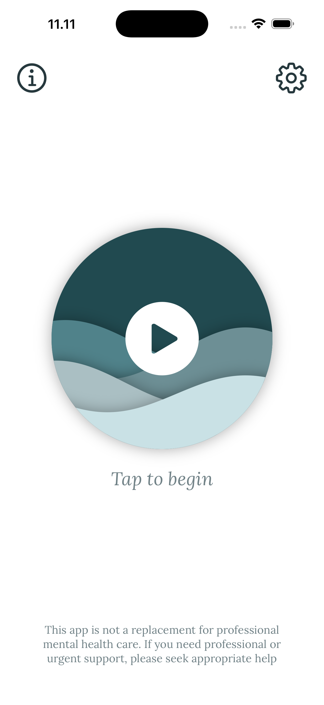
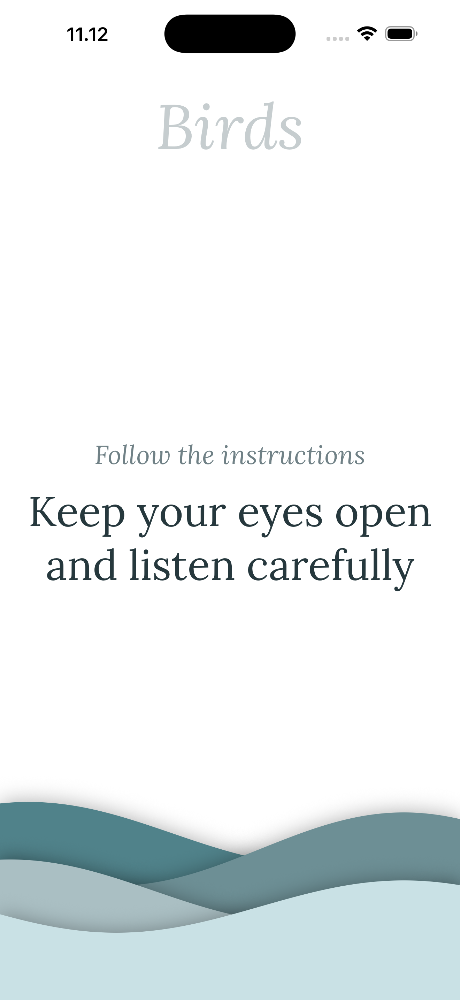
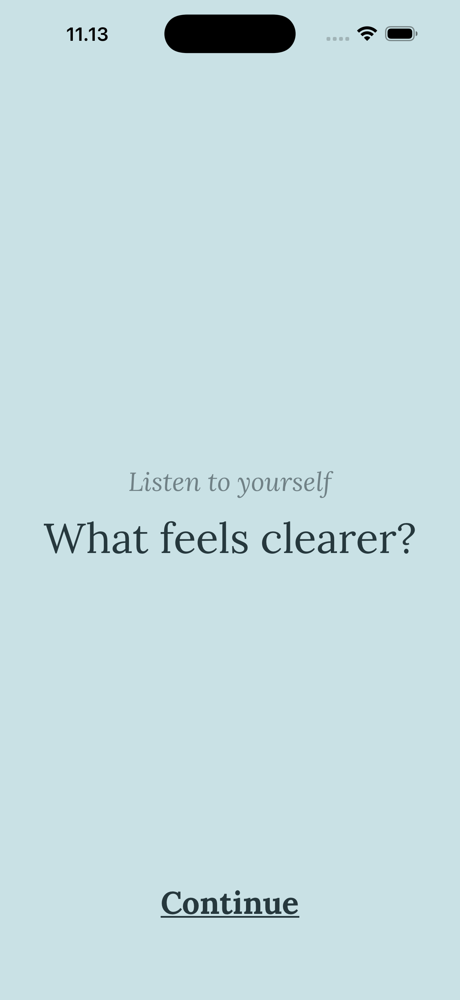
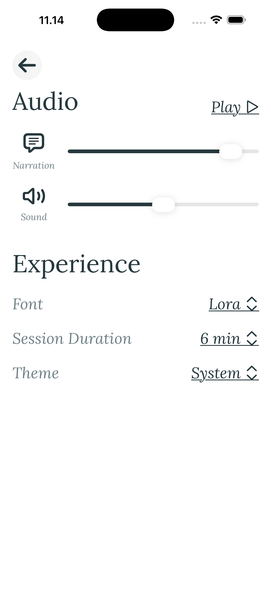

  

  # Oberron

  An audio-first digital mental health experience designed to help people interrupt rumination and regain intentional attention through guided Attention Training Technique (ATT).
  
  <!-- Badges -->
  

    
    
    
  

---

## Overview

When people become caught in rumination or overwhelming thoughts, even simple self-regulation can become difficult. Oberron explores how a digital experience can support that moment without asking the user to navigate a complex interface or process large amounts of information.

The experience is built around an audio-first implementation of the Attention Training Technique (ATT), using spatialized sound and guided narration to direct attention through different listening tasks. Rather than requiring continuous interaction with the screen, Oberron lets the user primarily listen and follow the guidance. After the training session, a short guided reflection helps the user notice their current state and regain perspective before deciding what to do next.

Oberron is an exploration of how interaction design, spatial audio, and evidence-informed psychological techniques can work together to support self-regulation.

### iOS Previews

  
  
  
  

## Support

If you have feedback, questions regarding the ATT audio implementation, or need to report an issue, please feel free to reach out.

### Contact

- **Email:** [akbar@reishandy.id](mailto:akbar@reishandy.id)
- **Report an Issue:** [https://github.com/Project-Oberron/Oberron/issues/new](https://github.com/Project-Oberron/Oberron/issues/new)

## Key Features

### Attention Training Technique (ATT)
* **Selective Attention:** Focuses your awareness on specific, localized audio stimuli across nature, everyday items, crafts, and machinery.
* **Rapid Attention Switching:** Dynamically accelerates focus shifts across randomized spatial audio points to train mental flexibility.
* **Divided Attention:** Expands attention to simultaneously perceive the entire 360-degree acoustic environment.
* **Custom Durations:** Tailor session lengths (6 min, 12 min, or 24 min) to fit your schedule and concentration level.

### 3D Spatial Audio Engine
* **Positional Sound Field:** Built on `AVAudioEngine` and `AVAudioEnvironmentNode` to place distinct audio cues in real-time 3D coordinates around the listener.
* **Layered Soundscapes:** Integrates rich ambient recordings with clear, calming spoken instructions.
* **Independent Mix Controls:** Adjust narration and ambient sound levels independently directly within the app.

### Guided Mindful Reflection
* **Low-Friction Check-Ins:** Automatically transitions from audio training into gentle Notice, Perspective, and Orient prompts.
* **Ambient Atmosphere:** Soothing background harmonies support introspection without demanding intense visual focus.

### Accessibility & iOS Integrations
* **Dyslexia-Friendly Typography:** Integrated OpenDyslexic, Lora, and system typography with adaptive scaling.
* **App Shortcuts & Siri:** Initiate sessions completely hands-free using custom Siri voice phrases.
* **Hardware & System Controls:** Quick access through Action Button configuration, Lock Screen widgets, and iOS Control Center toggles.

## Architecture & Tech Stack

* **Language:** Swift 6
* **UI Framework:** SwiftUI (Clean MVVM with `@Observable`
* **Audio Engine:** AVFoundation (`AVAudioEngine`, `AVAudioEnvironmentNode`, 3D Spatial Positioning)
* **System Integration:** AppIntents, WidgetKit
* **Architecture:** Domain-Driven Design with isolated Core Services (`AudioService`, `NavigationService`, `PreferenceService`)

## License

This project is licensed under the GNU Affero General Public License v3.0 (AGPL-3.0). See the [LICENSE](LICENSE) file for full details.

---

  <b>Authors</b>
  

    <a href="https://github.com/Reishandy">Muhammad Akbar Reishandy</a> (Lead Designer & Programmer) &nbsp;•&nbsp;
    <a href="https://github.com/caidencosta">Caiden De Costa</a> &nbsp;•&nbsp;
    <a href="https://github.com/cellofarrel">Cello Farrel Tanojo</a>
  

